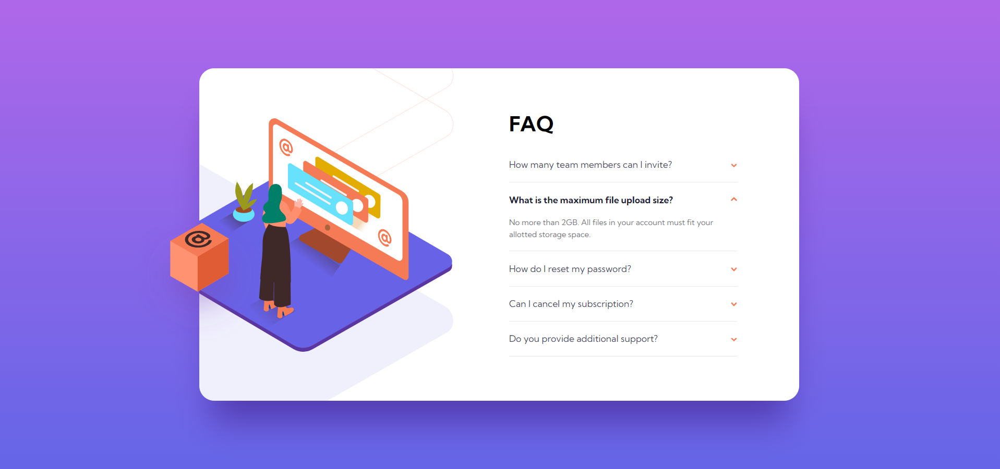

# Frontend Mentor - FAQ accordion card solution

This is a solution to the [FAQ accordion card challenge on Frontend Mentor](https://www.frontendmentor.io/challenges/faq-accordion-card-XlyjD0Oam). Frontend Mentor challenges help you improve your coding skills by building realistic projects. 

## Table of contents

- [Overview](#overview)
  - [The challenge](#the-challenge)
  - [Screenshot](#screenshot)
  - [Links](#links)
- [My process](#my-process)
  - [Built with](#built-with)
- [Author](#author)

## Overview

### The challenge

Users should be able to:

- View the optimal layout for the component depending on their device's screen size
- See hover states for all interactive elements on the page
- Hide/Show the answer to a question when the question is clicked
- **Bonus**: Complete the challenge without using JavaScript

### Screenshot

### Links

- Solution URL: [https://github.com/AdrianX19/faq-accordion-card](https://github.com/AdrianX19/faq-accordion-card)
- Live Site URL: [https://adrianx19.github.io/faq-accordion-card/](https://adrianx19.github.io/faq-accordion-card/)

## My process

### Built with

- Semantic HTML5 markup
- CSS custom properties
- Flexbox
- Media queries

## Author

- Frontend Mentor - [@AdrianX19](https://www.frontendmentor.io/profile/AdrianX19)

